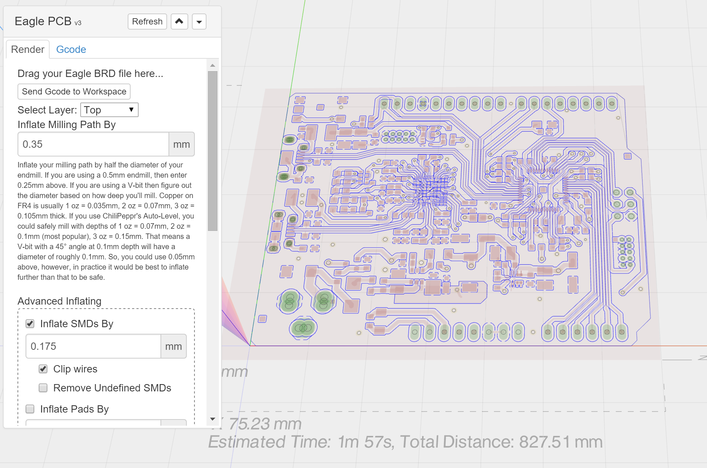

# com-chilipeppr-widget-eagle
This widget lets you drag in an Eagle PCB ".brd" file to mill.



## ChiliPeppr Widget / Eagle BRD v4

All ChiliPeppr widgets/elements are defined using cpdefine() which is a method
that mimics require.js. Each defined object must have a unique ID so it does
not conflict with other ChiliPeppr widgets.

| Item                  | Value           |
| -------------         | ------------- | 
| ID                    | com-chilipeppr-widget-eagle |
| Name                  | Widget / Eagle BRD v4 |
| Description           | This widget lets you drag in an Eagle PCB ".brd" file to mill. |
| chilipeppr.load() URL | http://raw.githubusercontent.com/raykholo/widget-stlViewer3/master/auto-generated-widget.html |
| Edit URL              | http://ide.c9.io/raykholo/widget-stlviewer3 |
| Github URL            | http://github.com/raykholo/widget-stlViewer3 |
| Test URL              | https://preview.c9users.io/raykholo/widget-stlviewer3/widget.html |

## Example Code for chilipeppr.load() Statement

You can use the code below as a starting point for instantiating this widget 
inside a workspace or from another widget. The key is that you need to load 
your widget inlined into a div so the DOM can parse your HTML, CSS, and 
Javascript. Then you use cprequire() to find your widget's Javascript and get 
back the instance of it.

```javascript
chilipeppr.load(
  "#myDivWidgetInsertedInto",
  "http://raw.githubusercontent.com/raykholo/widget-stlViewer3/master/auto-generated-widget.html",
  function() {
    // Callback after widget loaded into #myDivWidgetInsertedInto
    cprequire(
      ["inline:com-chilipeppr-widget-eagle"], // the id you gave your widget
      function(mywidget) {
        // Callback that is passed reference to your newly loaded widget
        console.log("My widget just got loaded.", mywidget);
        mywidget.init();
      }
    );
  }
);

```

## Publish

This widget/element publishes the following signals. These signals are owned by this widget/element and are published to all objects inside the ChiliPeppr environment that listen to them via the 
chilipeppr.subscribe(signal, callback) method. 
To better understand how ChiliPeppr's subscribe() method works see amplify.js's documentation at http://amplifyjs.com/api/pubsub/

  <table id="com-chilipeppr-elem-pubsubviewer-pub" class="table table-bordered table-striped">
      <thead>
          <tr>
              <th style="">Signal</th>
              <th style="">Description</th>
          </tr>
      </thead>
      <tbody>
      <tr valign="top"><td>/com-chilipeppr-widget-eagle/onAddGcode</td><td>This signal lets a 3rd party add-on inject its own Gcode into the 
            overall final Gcode for the Eagle BRD Widget. Here is an example of how to subscribe. <br><br><pre>
chilipeppr.subscribe(
    "/com-chilipeppr-widget-eagle/addGcode", 
    this, 
    this.myOnAddGcode
);
</pre>Then, your callback would look like this with 4 parameters receiving the variables 
            that the addGcode publish signal sends you. <br><br><pre>
onAddGcode : function(addGcodeCallback, gcodeParts, eagleWidget, helpDesc){ 
    console.log("Got onAddGcode:", arguments); 
    // this method calls back to the main Eagle widget to inject our Gcode 
    addGcodeCallback(1500, myOwnGcode ); 
} 
</pre>The 1500 in the example above is to attach a priority to where our Gcode will get positioned. 
            The base Gcode ends around line 900. The footer starts at line 2000. So putting our Gcode at 
            the end but before the footer means using 1500 should do fine. You can analyze the existing 
            Gcode by looking at parameter 2 gcodeParts to see if an index has already been used so you 
            don't clobber it. If you want to delete Gcode from gcodeParts you could do that as well and 
            the main widget will reflect the deletion. 
            </td></tr><tr valign="top"><td>/com-chilipeppr-widget-eagle/beforeLayerGenerate</td><td>This widget fires a signal before generating the Three.js objects
                and Clipper paths for a board layer. The Three.js objects are 3D objects representing the
                pads, vias, smds, wires, polygons, and dimensions. Those Three.js objects are used to
                populate the 3D viewer and to calculate 2D Clipper paths from. <br><br>Clipper paths are the 2D XY
                values of all the layer's objects and are generated so that unions and diffs can be
                calculated on those paths in the render step. Clipper paths can be easily inflated and
                deflated by the Clipper.js library which is why they are so important to this widget.<br><br>When you get this signal a reference to "this", i.e. the Eagle Widget, is included in
                the payload so you may use it to manipulate this widget as you see fit.</td></tr><tr valign="top"><td>/com-chilipeppr-widget-eagle/afterLayerGenerate</td><td>Please see the /beforeLayerGenerate description to understand this
                signal better. The /afterLayerGenerate signal is fired after this widget is done
                generating the board layer. The payload is the same as the before signal.</td></tr><tr valign="top"><td>/com-chilipeppr-widget-eagle/beforeToolPathRender</td><td>This widget fires a signal before the rendering of the tool path 
                for the milling of the Eagle BRD. As the user tests out different inflate values, you 
                will get this signal for each re-render of the tool path the user asks for, i.e. when 
                they click the "render" button.<br><br>In the payload is a reference to "this" so you can possibly grab info or do other 
                manipulations of the board before we render the tool path. This is especially useful for add-on 
                widgets to the Eagle BRD widget such as the Solder Paste Dispenser Add-On or the
                Pick and Place Add-On.
                </td></tr><tr valign="top"><td>/com-chilipeppr-widget-eagle/afterToolPathRender</td><td>This widget fires a signal after the rendering of the tool path 
                for the Eagle BRD. The tool path is the blue line in the 3D viewer.
                Similar to the /beforeToolPathRender signal, in the payload is a reference to "this" so you can possibly grab info or do other 
                manipulations of the board after we render. This is especially useful for add-on 
                widgets to the Eagle BRD widget such as the Solder Paste Dispenser Add-On or the
                Pick and Place Add-On.
                </td></tr>    
      </tbody>
  </table>

## Subscribe

This widget/element subscribes to the following signals. These signals are owned by this widget/element. Other objects inside the ChiliPeppr environment can publish to these signals via the chilipeppr.publish(signal, data) method. 
To better understand how ChiliPeppr's publish() method works see amplify.js's documentation at http://amplifyjs.com/api/pubsub/

  <table id="com-chilipeppr-elem-pubsubviewer-sub" class="table table-bordered table-striped">
      <thead>
          <tr>
              <th style="">Signal</th>
              <th style="">Description</th>
          </tr>
      </thead>
      <tbody>
      <tr><td colspan="2">(No signals defined in this widget/element)</td></tr>    
      </tbody>
  </table>

## Foreign Publish

This widget/element publishes to the following signals that are owned by other objects. 
To better understand how ChiliPeppr's subscribe() method works see amplify.js's documentation at http://amplifyjs.com/api/pubsub/

  <table id="com-chilipeppr-elem-pubsubviewer-foreignpub" class="table table-bordered table-striped">
      <thead>
          <tr>
              <th style="">Signal</th>
              <th style="">Description</th>
          </tr>
      </thead>
      <tbody>
      <tr><td colspan="2">(No signals defined in this widget/element)</td></tr>    
      </tbody>
  </table>

## Foreign Subscribe

This widget/element publishes to the following signals that are owned by other objects.
To better understand how ChiliPeppr's publish() method works see amplify.js's documentation at http://amplifyjs.com/api/pubsub/

  <table id="com-chilipeppr-elem-pubsubviewer-foreignsub" class="table table-bordered table-striped">
      <thead>
          <tr>
              <th style="">Signal</th>
              <th style="">Description</th>
          </tr>
      </thead>
      <tbody>
      <tr valign="top"><td>/com-chilipeppr-widget-eagle/com-chilipeppr-elem-dragdrop/ondropped</td><td>We subscribe to this signal at a higher priority to intercept the signal, double check if it is an Eagle Brd file and if so, we do not let it propagate by returning false. That way the 3D Viewer, Gcode widget, or other widgets will not get Eagle Brd file drag/drop events because they will not know how to interpret them.</td></tr>    
      </tbody>
  </table>

## Methods / Properties

The table below shows, in order, the methods and properties inside the widget/element.

  <table id="com-chilipeppr-elem-methodsprops" class="table table-bordered table-striped">
      <thead>
          <tr>
              <th style="">Method / Property</th>
              <th>Type</th>
              <th style="">Description</th>
          </tr>
      </thead>
      <tbody>
      <tr valign="top"><td>id</td><td>string</td><td>"com-chilipeppr-widget-eagle"<br><br>The ID of the widget. You must define this and make it unique.</td></tr><tr valign="top"><td>name</td><td>string</td><td>"Widget / Eagle BRD v4"</td></tr><tr valign="top"><td>desc</td><td>string</td><td>"This widget lets you drag in an Eagle PCB \".brd\" file to mill."</td></tr><tr valign="top"><td>url</td><td>string</td><td>"http://raw.githubusercontent.com/raykholo/widget-stlViewer3/master/auto-generated-widget.html"</td></tr><tr valign="top"><td>fiddleurl</td><td>string</td><td>"http://ide.c9.io/raykholo/widget-stlviewer3"</td></tr><tr valign="top"><td>githuburl</td><td>string</td><td>"http://github.com/raykholo/widget-stlViewer3"</td></tr><tr valign="top"><td>testurl</td><td>string</td><td>"http://widget-stlviewer3-raykholo.c9users.io/widget.html"</td></tr><tr valign="top"><td>publish</td><td>object</td><td>Please see docs above.<br><br>Define the publish signals that this widget/element owns or defines so that
other widgets know how to subscribe to them and what they do.</td></tr><tr valign="top"><td>subscribe</td><td>object</td><td>Please see docs above.<br><br>Define the subscribe signals that this widget/element owns or defines so that
other widgets know how to subscribe to them and what they do.</td></tr><tr valign="top"><td>foreignPublish</td><td>object</td><td>Please see docs above.<br><br>Document the foreign publish signals, i.e. signals owned by other widgets
or elements, that this widget/element publishes to.</td></tr><tr valign="top"><td>foreignSubscribe</td><td>object</td><td>Please see docs above.<br><br>Document the foreign subscribe signals, i.e. signals owned by other widgets
or elements, that this widget/element subscribes to.</td></tr><tr valign="top"><td>init</td><td>function</td><td>function (doMyOwnDragDrop) <br><br>All widgets should have an init method. It should be run by the
instantiating code like a workspace or a different widget.</td></tr><tr valign="top"><td>activateWidget</td><td>function</td><td>function () <br><br>This method is called from the main workspace telling us the user
just activated us as a widget. This is not the same as load. Load
happens once. Activate happens many times if user closes then opens
us.</td></tr><tr valign="top"><td>unactivateWidget</td><td>function</td><td>function () </td></tr><tr valign="top"><td>init3d</td><td>function</td><td>function () <br><br>Try to get a reference to the 3D viewer.</td></tr><tr valign="top"><td>onInit3dSuccess</td><td>function</td><td>function () </td></tr><tr valign="top"><td>obj3d</td><td>object</td><td></td></tr><tr valign="top"><td>obj3dmeta</td><td>object</td><td></td></tr><tr valign="top"><td>userCallbackForGet3dObj</td><td>object</td><td></td></tr><tr valign="top"><td>get3dObj</td><td>function</td><td>function (callback) </td></tr><tr valign="top"><td>get3dObjCallback</td><td>function</td><td>function (data, meta) </td></tr><tr valign="top"><td>is3dViewerReady</td><td>boolean</td><td></td></tr><tr valign="top"><td>clear3dViewer</td><td>function</td><td>function () </td></tr><tr valign="top"><td>clearEagleBrd</td><td>function</td><td>function () </td></tr><tr valign="top"><td>clearEagleBrdStep2</td><td>function</td><td>function () </td></tr><tr valign="top"><td>setupGcodeTab</td><td>function</td><td>function () </td></tr><tr valign="top"><td>sendGcodeToWorkspace</td><td>function</td><td>function () </td></tr><tr valign="top"><td>setupDragDrop</td><td>function</td><td>function () </td></tr><tr valign="top"><td>eagle</td><td>object</td><td></td></tr><tr valign="top"><td>open</td><td>function</td><td>function (data, info) </td></tr><tr valign="top"><td>bigSTLGroup</td><td>object</td><td></td></tr><tr valign="top"><td>testLoadSTL</td><td>function</td><td>function () </td></tr><tr valign="top"><td>loadStlModel</td><td>function</td><td>function (modelData) </td></tr><tr valign="top"><td>draw3d</td><td>function</td><td>function (callback) <br><br>We need the 3D viewer to be ready to go for us to generate our 3D view,
so do a little bit of a wait sequence here where we try 3 times to
grab the 3D viewer object and then we can render our board.
Alternately, we could render our board and then inject into the 3D
viewer later. Not sure why I didn't do it that way initially.</td></tr><tr valign="top"><td>colorSignal</td><td>number</td><td></td></tr><tr valign="top"><td>colorSmd</td><td>number</td><td></td></tr><tr valign="top"><td>colorSignalBottom</td><td>number</td><td></td></tr><tr valign="top"><td>colorSmdBottom</td><td>number</td><td></td></tr><tr valign="top"><td>colorVia</td><td>number</td><td></td></tr><tr valign="top"><td>colorPad</td><td>number</td><td></td></tr><tr valign="top"><td>colorMill</td><td>number</td><td></td></tr><tr valign="top"><td>colorHole</td><td>number</td><td></td></tr><tr valign="top"><td>colorsDrop</td><td>object</td><td></td></tr><tr valign="top"><td>colorDimension</td><td>number</td><td></td></tr><tr valign="top"><td>opacitySignal</td><td>number</td><td></td></tr><tr valign="top"><td>opacityDimension</td><td>number</td><td></td></tr><tr valign="top"><td>opacityVia</td><td>number</td><td></td></tr><tr valign="top"><td>opacityPad</td><td>number</td><td></td></tr><tr valign="top"><td>endmillSize</td><td>number</td><td></td></tr><tr valign="top"><td>actualEndmill</td><td>number</td><td></td></tr><tr valign="top"><td>inflateMillPathBy</td><td>object</td><td></td></tr><tr valign="top"><td>paths</td><td>object</td><td></td></tr><tr valign="top"><td>pathsUnion</td><td>object</td><td></td></tr><tr valign="top"><td>pathsUnionHoles</td><td>object</td><td></td></tr><tr valign="top"><td>threeDimensions</td><td>object</td><td></td></tr><tr valign="top"><td>activeLayer</td><td>string</td><td>"Top"</td></tr><tr valign="top"><td>clipperDimensions</td><td>object</td><td></td></tr><tr valign="top"><td>onDraw3dReady</td><td>function</td><td>function () <br><br>This is a key method that will actually start the traversal of the
entire Eagle BRD and generate Three.js objects for each pad/smd/via/wire, etc.
Then it will generate Clipper Paths which are just 2d xy values in the
format that the Clipper library wants so we can do unions and diffs
which is important to generate the isolation paths as well as deal with
polygons that may be on the board representing signal planes like a 
GND plane.</td></tr><tr valign="top"><td>onDraw3dReadyAfter</td><td>function</td><td>function () </td></tr><tr valign="top"><td>clearanceHeight</td><td>number</td><td></td></tr><tr valign="top"><td>depthOfSignalMilling</td><td>number</td><td></td></tr><tr valign="top"><td>feedRatePlunge</td><td>number</td><td></td></tr><tr valign="top"><td>feedRateSignals</td><td>number</td><td></td></tr><tr valign="top"><td>feedRateDimensions</td><td>number</td><td></td></tr><tr valign="top"><td>drillFeedrate</td><td>number</td><td></td></tr><tr valign="top"><td>drillMaxDiameter</td><td>number</td><td></td></tr><tr valign="top"><td>drillDepth</td><td>number</td><td></td></tr><tr valign="top"><td>depthOfDimensions</td><td>number</td><td></td></tr><tr valign="top"><td>millDiameter</td><td>number</td><td></td></tr><tr valign="top"><td>stepDownDimensions</td><td>number</td><td></td></tr><tr valign="top"><td>stepDownPasses</td><td>number</td><td></td></tr><tr valign="top"><td>generateGcodeHole</td><td>function</td><td>function (diameter, x, y)</td></tr><tr valign="top"><td>exportGcodeHeader</td><td>function</td><td>function ()</td></tr><tr valign="top"><td>exportGcodeMilling</td><td>function</td><td>function ()</td></tr><tr valign="top"><td>exportGcodeMarkVias</td><td>function</td><td>function ()</td></tr><tr valign="top"><td>exportGcodeMarkPads</td><td>function</td><td>function ()</td></tr><tr valign="top"><td>exportGcodeDrillVias</td><td>function</td><td>function ()</td></tr><tr valign="top"><td>exportGcodeDrillPads</td><td>function</td><td>function ()</td></tr><tr valign="top"><td>exportGcodeDimensions</td><td>function</td><td>function ()</td></tr><tr valign="top"><td>exportGcodeFooter</td><td>function</td><td>function ()</td></tr><tr valign="top"><td>exportGcode</td><td>function</td><td>function () </td></tr><tr valign="top"><td>gcodeParts</td><td>object</td><td></td></tr><tr valign="top"><td>addGcode</td><td>function</td><td>function (count, gcode)</td></tr><tr valign="top"><td>getGcode</td><td>function</td><td>function () </td></tr><tr valign="top"><td>onRefresh</td><td>function</td><td>function (event, callback) <br><br>This is a key method that will actually start the traversal of the
entire Eagle BRD and generate Three.js objects for each pad/smd/via/wire, etc.
Then it will generate Clipper Paths which are just 2d xy values in the
format that the Clipper library wants so we can do unions and diffs
which is important to generate the isolation paths as well as deal with
polygons that may be on the board representing signal planes like a 
GND plane.
/
onDraw3dReady: function () {<br><br>console.group("draw3d");<br><br>// inform any listeners that we're starting parsing, i.e. we're done with
// all of our draw3dxxx functions which means all our three.js objects
// and clipper objects are generated.
chilipeppr.publish("/" + this.id + '/beforeLayerGenerate', this);<br><br>console.log("iterating Eagle Brd and drawing into 3d viewer");
console.log("eagle obj we will draw:", this.eagle);
this.clear3dViewer();<br><br>//var activeLayer = 'Top';
//var activeLayer = 'Bottom';<br><br>// these methods will draw all Eagle objects into several global
// properties, the most important of which is this.clipperBySignalKey
// which holds a structured object of each signal, i.e. +3V, GND, etc.
/*
this.draw3dSignalWires(this.eagle.eagleLayersByName[this.activeLayer]);
this.draw3dSignalPolygons(this.eagle.eagleLayersByName[this.activeLayer]);
this.draw3dElements(this.eagle.eagleLayersByName[this.activeLayer]);<br><br>this.draw3dVias('1-16');
this.threeDimensions = this.draw3dDimension(this.endmillSize);
/
this.testLoadSTL();
//this.drawAllStlModels();
//this.obj3d.children = [];<br><br>// obj3d is the original THREE.Object3D() for the 3d
// viewer. the extents x/y/z vals are calculated off of
// it so we need a fake object to put in there
console.log("this.obj3d:", this.obj3d);<br><br>chilipeppr.publish('/com-chilipeppr-widget-3dviewer/viewextents' );<br><br>// inform any listeners that we're done parsing, i.e. we're done with
// all of our draw3dxxx functions which means all our three.js objects
// and clipper objects are generated.
chilipeppr.publish("/" + this.id + '/afterLayerGenerate', this);<br><br>setTimeout(this.onRefresh.bind(this, null, this.onDraw3dReadyAfter), 2000);<br><br>
console.log("done drawing Eagle PCB Board");
console.groupEnd();
},
onDraw3dReadyAfter: function() {
console.log("onDraw3dReadyAfter");
// ask 3d viewer to set things up now
chilipeppr.publish('/com-chilipeppr-widget-3dviewer/setunits', "mm" );
chilipeppr.publish('/com-chilipeppr-widget-3dviewer/drawextents' );
chilipeppr.publish('/com-chilipeppr-widget-3dviewer/viewextents' );
$(window).trigger('resize');
if (this.obj3dmeta && this.obj3dmeta.widget)
this.obj3dmeta.widget.wakeAnimate();
},<br><br>// Section on exporting Gcode<br><br>clearanceHeight: 1.0, // move z to clearance
// 1 oz = 0.035mm, 2 oz = 0.07mm, 3 oz = 0.105mm
depthOfSignalMilling: -0.1, // cutting how deep?
feedRatePlunge: 30, // plunging into FR4 copper
feedRateSignals: 80, // feedrate for milling signals,pads,smds,vias
feedRateDimensions: 100,
drillFeedrate: 100.0, // mm/min
drillMaxDiameter: 3.00, //mm/min
drillDepth: -1.7, // std thickness
depthOfDimensions: -1.7, // std thickness
millDiameter: 2,
stepDownDimensions: -0.5,
stepDownPasses: 3, // use passes or dimension
generateGcodeHole:function(diameter, x, y){
var radius = diameter/2;
var gdiameter = radius-(this.millDiameter/2); // inside milling 
var passesDeep = this.depthOfDimensions/this.stepDownPasses; // TODO: calculate my own passes<br><br>var result = '(generate hole at x:' + x + ' y:' + y + ' with dia:'+ diameter +' in ' + this.stepDownPasses + ' passes)' + "\n";
result += "F" + this.feedRateDimensions + "\n";
// Lift off
result += "G00 Z" + this.clearanceHeight + "\n";
// Go to outside from circle
result += "G00 X" + (x - gdiameter) + " Y" + y + "\n";
// check passes            
for(var i=0; i<this.stepDownPasses;i++){
var deep = passesDeep*(i+1);
// plunge in material
result += "G00 Z" + deep.toFixed(4) + "\n";
// mill circle
result += "G02 I" + gdiameter.toFixed(4) + "\n";
}<br><br>// Lift off
result += "G00 Z" + this.clearanceHeight + "\n";<br><br>return result;
},
exportGcodeHeader:function(){
var g = '';
g += "(Gcode generated by ChiliPeppr Eagle PCB Widget " + (new Date()).toLocaleString() + ")\n";
g += "G21 (mm mode)\n";
g += "G90 (abs mode)\n";
g += "M3 (spindle on)\n";
g += "TO M6 (set tool)\n"
return g;
},
exportGcodeMilling:function(){
var g = '';
this.paths.forEach(function(path) {
// move to clearance
g += "G0 Z" + this.clearanceHeight + "\n";
// move to first position of path
g += "G0 X" + path[0].X + " Y" + path[0].Y + "\n";
// move down
g += "G0 Z0\n";
g += "G1 Z" + this.depthOfSignalMilling + " F" + this.feedRatePlunge + "\n";
g += "F" + this.feedRateSignals + "\n";
for (var i = 1; i < path.length; i++) {
var pt = path[i];
g += "G1 X" + pt.X + " Y" + pt.Y + "\n";
}
// move to first point
g += "G1 X" + path[0].X + " Y" + path[0].Y + "\n";
// just to be safe, move to 2nd point to ensure all copper milled out
// but make sure we go at least 2mm, but no more
var v1 = new THREE.Vector3(path[0].X, path[0].Y);
var v2 = new THREE.Vector3(path[1].X, path[1].Y);
var dist = v1.distanceTo(v2);
if (dist > 2) {
// shorten it
var direction = new THREE.Vector3(v2.x-v1.x, v2.y-v1.y, 0);
direction.normalize();
var ray = new THREE.Ray(v1, direction);
v2 = ray.at(2);
//console.log("had to shorten distance. ray:", ray, " new v2:", v2, "v1:", v1);
}
g += "G1 X" + v2.x + " Y" + v2.y + "\n";
if (dist < 2) {
// go to 3rd point as well
g += "G1 X" + path[2].X + " Y" + path[2].Y + "\n";
}<br><br>// done with signal, go to z clearance<br><br>
}, this);<br><br>return g;
},
exportGcodeMarkVias:function(){
var g = '';
var that = this;<br><br>if(! $('#com-chilipeppr-widget-eagle .drill-markholes').is(':checked'))
return g;<br><br>// Drilling, first sort to drill diameter and change tool to first diameter
g += "(------ MARK VIAS -------)\n";
for ( diameter in this.sortObjByKey(this.drillVias) ){
this.drillVias[diameter].forEach(function(dvector){
g += "G0 Z" + that.clearanceHeight + "\n";
g += "G0 X" + dvector.X + " Y" + dvector.Y   + "\n";
g += "G0 Z0.1\n";
g += "G1 Z" + that.depthOfSignalMilling  + "\n";
});
g += "G0 Z" + that.clearanceHeight + "\n";
}
return g;
},
exportGcodeMarkPads:function(){
var g = '';
var that = this;<br><br>if(! $('#com-chilipeppr-widget-eagle .drill-markholes').is(':checked'))
return g;<br><br>// Drilling, first sort to drill diameter and change tool to first diameter
g += "(------ MARK PADS -------)\n";
for ( diameter in this.sortObjByKey(this.drillPads) ){
this.drillPads[diameter].forEach(function(dvector){
g += "G0 Z" + that.clearanceHeight + "\n";
g += "G0 X" + dvector.X + " Y" + dvector.Y   + "\n";
g += "G0 Z0.1\n";
g += "G1 Z" + that.depthOfSignalMilling  + "\n";
});
g += "G0 Z" + that.clearanceHeight + "\n";
}
return g;
},
exportGcodeDrillVias:function(){
var g = '';
var that = this;<br><br>if(! $('#com-chilipeppr-widget-eagle .use-drilling').is(':checked'))
return g;<br><br>// Drilling, first sort to drill diameter and change tool to first diameter
g += "(------ DRILLING VIAS -------)\n";
for ( diameter in this.sortObjByKey(this.drillVias) ){
g += "M5 (spindle off)\n";
g += "T" + this.toolCount++ + " M6 (set tool to drill with diameter " + diameter + ")\n";
g += "M3 (spindle on)\n";
g += "F" + this.drillFeedrate + "\n"; 
this.drillVias[diameter].forEach(function(dvector){
g += "G0 Z" + that.clearanceHeight + "\n";
g += "G0 X" + dvector.X + " Y" + dvector.Y   + "\n";
g += "G0 Z" + that.clearanceHeight/10 + "\n";
g += "G1 Z" + that.drillDepth  + "\n";
});
g += "G0 Z" + that.clearanceHeight + "\n";
}
return g;
},
exportGcodeDrillPads:function(){
var g = '';<br><br>if(! $('#com-chilipeppr-widget-eagle .use-drilling').is(':checked'))
return g;<br><br>var that = this;
g += "(------ DRILLING PADS -------)\n";
for ( diameter in this.sortObjByKey(this.drillPads)){
// don't drill holes bigger as max diameter
if(diameter > that.drillMaxDiameter)
break;
g += "M5 (spindle off)\n";
g += "T" + this.toolCount++ + " M6 (set tool to drill with diameter " + diameter + ")\n";
g += "M3 (spindle on)\n";
g += "F" + this.drillFeedrate + "\n"; 
this.drillPads[diameter].forEach(function(dvector){
g += "G0 Z" + that.clearanceHeight + "\n";
g += "G0 X" + dvector.X + " Y" + dvector.Y   + "\n";
g += "G0 Z" + that.clearanceHeight/10 + "\n";
g += "G1 Z" + that.drillDepth  + "\n";
});
g += "G0 Z" + that.clearanceHeight + "\n";
}
return g;
},
exportGcodeDimensions:function(){<br><br>var g = '';
var that = this;<br><br>var diaOfEndmill = $('.dimension-mill-diameter').val();<br><br>// DIMENSION Milling
g += "(------ DIMENSION Milling -------)\n";
g += "M5 (spindle off)\n";
g += "T" + this.toolCount++ + " M6 (set tool to mill dimension " + diaOfEndmill + ")\n";
g += "M3 (spindle on)\n";
g += "F" + this.feedRateDimensions + "\n";<br><br>
// generate holes are bigger as this.drillMaxDiameter
for ( diameter in this.sortObjByKey(this.drillPads)){
// only holes bigger as max diameter
if (diameter < that.drillMaxDiameter) continue;
this.drillPads[diameter].forEach(function(dvector) {
g += that.generateGcodeHole(diameter, dvector.X, dvector.Y)
});
}<br><br>
// generate dimensions
// we need to take into account the diameter of the endmill
// for milling dimensions
console.group("Generating Dimension Milling");<br><br>// if we have no dimensions, then let's return
if (!this.clipperDimension || !this.clipperDimension.length > 0) {
console.warn("for some reason there's no clipperDimension. huh?. returning.");
return g;
}<br><br>// create new inflated path
var millDim = this.getInflatePath([this.clipperDimension], diaOfEndmill / 2);
millDim = millDim[0];
// save original clipperDimensions to reset at end of method
console.log("original clipperDimension", this.clipperDimension);
console.log("inflated dimension:", millDim);
var origClipperDimensions = this.clipperDimension;
this.clipperDimension = millDim;<br><br>// TODO: please check if exists holes in eagle board
// move to clearance
g += "G0 Z" + this.clearanceHeight + "\n";
g += "(dimensions)\n";
// move to first position of path
if (this.clipperDimension[0] !== undefined)
g += "G0 X" + this.clipperDimension[0].X + " Y" + this.clipperDimension[0].Y + "\n";
// move down
g += "G0 Z0\n";
var newZ = 0;<br><br>var didLastPass = false;
while (!didLastPass) { //newZ > this.depthOfDimensions) {
newZ += this.stepDownDimensions;
if (newZ <= this.depthOfDimensions) {
// don't let z go that low
newZ = this.depthOfDimensions;
didLastPass = true;
}
g += "(step down " + this.stepDownDimensions + " for new z " + newZ + ")\n";
g += "G1 Z" + newZ + " F" + this.feedRatePlunge + "\n";
g += "F" + this.feedRateDimensions + "\n";
console.log("this.clipperDimension:", this.clipperDimension);<br><br>// we have dimensions defined as linePieces so must eliminate duplicates
var lastPt = {X:null,Y:null};
this.clipperDimension.forEach(function(pt) {
console.log("making final dimension mill. pt:", pt, "lastPt:", lastPt);
if (pt.X == lastPt.X && pt.Y == lastPt.Y) {
//console.log("dimension mill: skipping pt:", pt);
} else {
//console.log("dimension mill: adding pt:", pt);
g += "G1 X" + pt.X + " Y" + pt.Y + "\n";
}
lastPt = pt;
});
// move to first point
//g += "G1 X" + this.clipperDimension[0].X + " Y" + this.clipperDimension[0].Y + "\n";
// just to be safe, move to 2nd point no more than 3mm
//g += "G1 X" + this.clipperDimension[1].X + " Y" + this.clipperDimension[1].Y + "\n";<br><br>
}
this.clipperDimension = origClipperDimensions;
console.groupEnd();
return g;
},
exportGcodeFooter:function(){<br><br>var g = '';
g += "(------ FOOTER -------)\n";<br><br>// move to clearance
g += "G0 Z" + this.clearanceHeight + "\n";<br><br>// finalize gcode
g += "M5 (spindle stop)\n";
g += "M30 (prog stop)\n";
return g;
},
exportGcode: function() {
// We will walk through our mondo clipperBySignalKey object to generate
// our gcode.
// we will start with wires,smds,pads,vias first.
// then we'll move onto drills.
// then we'll finish with dimensions because use may want to swap
// endmills at end.
// we will also start at lower left and work our way along the end of each
// path and move to next.
// we also need to remove redundant moves.<br><br>this.toolCount = 0;
var i = 100;
this.addGcode(i, this.exportGcodeHeader()     );
i += 100;
this.addGcode(i, this.exportGcodeMilling()    );
i += 100;
this.addGcode(i, this.exportGcodeMarkVias()   );
i += 100;
this.addGcode(i, this.exportGcodeMarkPads()   );
i += 100;
this.addGcode(i, this.exportGcodeDrillVias()  );
i += 100;
this.addGcode(i, this.exportGcodeDrillPads()  );
i += 100;
this.addGcode(i, this.exportGcodeDimensions() );
i = 2000;
this.addGcode(i, this.exportGcodeFooter()      ); // let space for additional gcode entrys<br><br>// ask for additional gcode
// the user should synchronously inject it by calling back to us
// with eagleWidget.addGcode();
chilipeppr.publish(
"/com-chilipeppr-widget-eagle/addGcode", 
this.addGcode.bind(this), 
this.gcodeParts, 
this, 
'You need to callback the first parameter with a command like firstParameter(1000, "my gcode");. ' + 
'1000 would put your gcode after all the gcode generated by the base widget, but before the footer ' +
'which is at index of 2000. You can inspect the base widget gcode by looking at the 2nd parameter ' + 
'which is an array of the gcode parts and their indexes because you can insert anywhere there is an unused index.'
);<br><br>// once we get here all 3rd party add-ons that were listening for the publish should have
// injected their gcode and we can now move on
var g = this.getGcode();<br><br>console.log("done generating gcode. length:", g.length);
$('.com-chilipeppr-widget-eagle-gcode').text(g);
},
gcodeParts: [],
addGcode : function(count, gcode){
this.gcodeParts[count] = gcode;
},
getGcode : function() {
console.log('Get gcodeParts: ', this.gcodeParts);
return this.gcodeParts.join('');
},<br><br>
// Actual parsing of Eagle object and rendering of Three.js objects
// and the Clipper paths.<br><br>/*setupAdvancedInflateByUI: function() {
var smdEl = $('#com-chilipeppr-widget-eagle .inflate-smds-by');
var padEl = $('#com-chilipeppr-widget-eagle .inflate-pads-by');
var viaEl = $('#com-chilipeppr-widget-eagle .inflate-vias-by');
smdEl.keyup(function(evt) {
console.log("smdEl got keyup. evt:", evt);
$('#com-chilipeppr-widget-eagle .use-inflate-smds-by').prop('checked', true);
var val = parseFloat(smdEl.val());
if (isNaN(val)) {
smdEl.addClass("alert-danger");
} else {
smdEl.removeClass("alert-danger");
}
});
padEl.keyup(function(evt) {
console.log("padEl got keyup. evt:", evt);
$('#com-chilipeppr-widget-eagle .use-inflate-pads-by').prop('checked', true);
var val = parseFloat(padEl.val());
if (isNaN(val)) {
padEl.addClass("alert-danger");
} else {
padEl.removeClass("alert-danger");
}
});
viaEl.keyup(function(evt) {
console.log("viaEl got keyup. evt:", evt);
$('#com-chilipeppr-widget-eagle .use-inflate-vias-by').prop('checked', true);
var val = parseFloat(viaEl.val());
if (isNaN(val)) {
viaEl.addClass("alert-danger");
} else {
viaEl.removeClass("alert-danger");
}
});<br><br>// bind ctrl+enter
var that = this;
$('#com-chilipeppr-widget-eagle #eagle-main input').keypress(function(evt) {
console.log("got keypress. evt:", evt);
if (evt.ctrlKey && evt.charCode == 10) {
that.onRefresh(evt);
}
});
},</td></tr><tr valign="top"><td>threePathEndMill</td><td>object</td><td></td></tr><tr valign="top"><td>onRefresh2nd</td><td>function</td><td>function (event, callback) </td></tr><tr valign="top"><td>getInflatePathWithConstraint</td><td>function</td><td>function (paths, inflateBy, constraints) </td></tr><tr valign="top"><td>raycaster</td><td>object</td><td></td></tr><tr valign="top"><td>projector</td><td>object</td><td></td></tr><tr valign="top"><td>arrowHelper</td><td>object</td><td></td></tr><tr valign="top"><td>intersectObjects</td><td>object</td><td></td></tr><tr valign="top"><td>renderArea</td><td>object</td><td></td></tr><tr valign="top"><td>infoArea</td><td>object</td><td></td></tr><tr valign="top"><td>infoSignalArea</td><td>object</td><td></td></tr><tr valign="top"><td>lastIntersect</td><td>object</td><td></td></tr><tr valign="top"><td>hidePopupsElem</td><td>object</td><td></td></tr><tr valign="top"><td>setupMouseOver</td><td>function</td><td>function () </td></tr><tr valign="top"><td>reactivateMouseMove</td><td>function</td><td>function () </td></tr><tr valign="top"><td>deactivateMouseMove</td><td>function</td><td>function () </td></tr><tr valign="top"><td>hidePopups</td><td>function</td><td>function () </td></tr><tr valign="top"><td>lastIntersectOtherMaterials</td><td>object</td><td></td></tr><tr valign="top"><td>onMouseOver</td><td>function</td><td>function (event) </td></tr><tr valign="top"><td>clipperDimension</td><td>object</td><td></td></tr><tr valign="top"><td>getDimensionWires</td><td>function</td><td>function () </td></tr><tr valign="top"><td>draw3dDimension</td><td>function</td><td>function (endmillSize) </td></tr><tr valign="top"><td>mySceneGroup</td><td>object</td><td></td></tr><tr valign="top"><td>sceneReAddMySceneGroup</td><td>function</td><td>function () </td></tr><tr valign="top"><td>sceneRemoveMySceneGroup</td><td>function</td><td>function () </td></tr><tr valign="top"><td>sceneAdd</td><td>function</td><td>function (obj) </td></tr><tr valign="top"><td>sceneRemove</td><td>function</td><td>function (obj) </td></tr><tr valign="top"><td>mostRecentSTL</td><td>object</td><td></td></tr><tr valign="top"><td>onDropped</td><td>function</td><td>function (data, info) </td></tr><tr valign="top"><td>onDragOver</td><td>function</td><td>function () </td></tr><tr valign="top"><td>onDragLeave</td><td>function</td><td>function () </td></tr><tr valign="top"><td>isVidLoaded</td><td>boolean</td><td></td></tr><tr valign="top"><td>lazyLoadTutorial</td><td>function</td><td>function () </td></tr><tr valign="top"><td>options</td><td>object</td><td></td></tr><tr valign="top"><td>setupUiFromLocalStorage</td><td>function</td><td>function () </td></tr><tr valign="top"><td>saveOptionsLocalStorage</td><td>function</td><td>function () </td></tr><tr valign="top"><td>showBody</td><td>function</td><td>function (evt) </td></tr><tr valign="top"><td>hideBody</td><td>function</td><td>function (evt) </td></tr><tr valign="top"><td>btnSetup</td><td>function</td><td>function () </td></tr><tr valign="top"><td>statusEl</td><td>object</td><td></td></tr><tr valign="top"><td>status</td><td>function</td><td>function (txt) </td></tr><tr valign="top"><td>forkSetup</td><td>function</td><td>function () </td></tr>
      </tbody>
  </table>


## About ChiliPeppr

[ChiliPeppr](http://chilipeppr.com) is a hardware fiddle, meaning it is a 
website that lets you easily
create a workspace to fiddle with your hardware from software. ChiliPeppr provides
a [Serial Port JSON Server](https://github.com/johnlauer/serial-port-json-server) 
that you run locally on your computer, or remotely on another computer, to connect to 
the serial port of your hardware like an Arduino or other microcontroller.

You then create a workspace at ChiliPeppr.com that connects to your hardware 
by starting from scratch or forking somebody else's
workspace that is close to what you are after. Then you write widgets in
Javascript that interact with your hardware by forking the base template 
widget or forking another widget that
is similar to what you are trying to build.

ChiliPeppr is massively capable such that the workspaces for 
[TinyG](http://chilipeppr.com/tinyg) and [Grbl](http://chilipeppr.com/grbl) CNC 
controllers have become full-fledged CNC machine management software used by
tens of thousands.

ChiliPeppr has inspired many people in the hardware/software world to use the
browser and Javascript as the foundation for interacting with hardware. The
Arduino team in Italy caught wind of ChiliPeppr and now
ChiliPeppr's Serial Port JSON Server is the basis for the 
[Arduino's new web IDE](https://create.arduino.cc/). If the Arduino team is excited about building on top
of ChiliPeppr, what
will you build on top of it?

